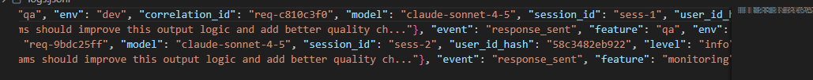
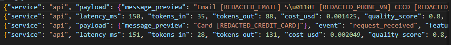
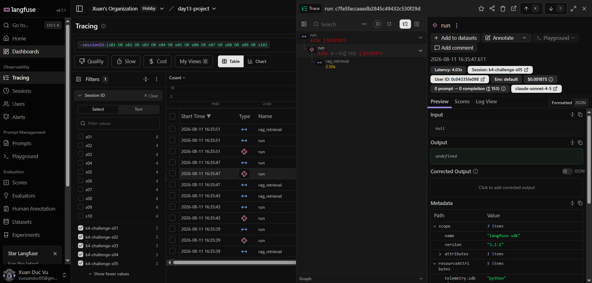

# Báo cáo Day 13 Observability

## 1. Thông tin nhóm

- Tên nhóm: A1
- Repository URL: [Github](https://github.com/endermagician15/Day13-K4-Observability)
- Commit SHA cuối: c6233a2b11247868f63c7b7300ddeadd499ae759
- Thành viên và vai trò:

| STT | Thành viên | MSSV | Vai trò phụ trách |
|---|---|---|---|
| 1 | Nguyễn Minh Hiếu | 2A202601816 | Logging & PII |
| 2 | Nguyễn Văn Đức | 2A202601422 | Tracing & Prompt Version |
| 3 | Đào Hải Đăng | 2A202601814 | Dashboard, SLO & Alerts |
| 4 | Vũ Xuân Đức | 2A202601668 | Incident, Report & Demo |

## 2. Kết quả kỹ thuật

- Điểm `validate_logs.py`: 100/100 (4/4 tiêu chí PASSED)
- Tổng số traces:
- Số PII leak còn lại: 0
- Link/đường dẫn dashboard: chạy `python scripts/render_dashboard.py --output dashboard.html`, hoặc mở artifact [dashboard.html](evidence/dashboard.html).

## 3. Logging và tracing

- Evidence correlation ID: 
- Evidence PII redaction: 
- Evidence trace waterfall: 
- Giải thích một span đáng chú ý: Span `rag_retrieval` (trong Trace ID `c7fa5faccaaadb2845c49432c530f29d`) kéo dài tới 2.50s, chiếm khoảng 62% tổng thời gian request. Đây là điểm nghẽn chính gây trễ hệ thống, trong khi các span xử lý LLM và middleware chỉ mất khoảng 150ms - 200ms.

## 4. Prompt versioning

- Prompt name: `day13-chat`
- Version/label baseline: Version 1 (label: `baseline`, `production`)
- Version/label candidate: Version 2 (label: `candidate`)
- Trace ID của mỗi version: 
* Version 1 (Baseline): `5b571bf0f646490be350064cd2f64c54`
* Version 2 (Candidate): `effb2e1ee16b5b2c1eac6b80247f1e39`
- Bằng chứng đổi label hoặc rollback: Được lưu trong file [prompt_versions_info.md](evidence/prompt_versions_info.md). Trace ID promote v2 lên production: `a4c0545bcbf2139c339c845e2c48969a`; Trace ID rollback production về v1: `2fb7baec439f129348242f4e391495b1`.

## 5. Dashboard, SLO và alerts

- Kết quả `validate_dashboard.py`: `HỢP LỆ: 6/6 panel có trong dashboard contract.`
- Evidence dashboard: [Dashboard](evidence/dashboard.png), được render từ `data/logs.jsonl` bằng `scripts/render_dashboard.py`.
- Dashboard runtime hiển thị đúng sáu panel Latency (P50/P95/P99), Traffic, Errors, Cost, Tokens và Quality; cửa sổ mặc định 60 phút, refresh 30 giây, có đơn vị và threshold theo `config/dashboard.yaml`.
- SLO đã chọn và lý do: P95 latency ≤ 3000 ms (99.5%), error rate ≤ 2% (99.0%), daily cost ≤ 2.50 USD (100%) và quality score ≥ 0.75 (95%). Các ngưỡng này khớp với threshold trên dashboard để nối metric với hành động vận hành.
- Alert rules và runbook: `config/alert_rules.yaml` gồm
  `HighLatencyP95`, `HighErrorRate` và `LowQualityScore`; hướng dẫn nằm trong [docs/alerts.md](../docs/alerts.md).

## 6. Điều tra challenge

- Challenge ID: day13-k4-observability-v1
- Triệu chứng từ metrics: P95 Latency vọt lên 3555 ms trên Dashboard (trạng thái BREACH vì vượt ngưỡng 3000ms). Độ trễ đo ở phía Client (Load test) vọt lên cực kỳ cao (từ 18.6s đến 22.7s) do hàng đợi xử lý bị tắc nghẽn khi chạy concurrency 5.
- Trace ID liên quan: c7fa5faccaaadb2845c49432c530f29d
- Log line/correlation ID liên quan: Correlation ID: `req-e555de9a` (tương ứng với Session ID `k4-challenge-s05`). Dòng log response_sent liên quan: `{"correlation_id": "req-e555de9a", "event": "response_sent", "latency_ms": 2892, "service": "api", "session_id": "k4-challenge-s05", "ts": "2026-08-11T09:35:51.642739Z"}`
- Root cause: Endpoint `/chat` khai báo là `async def` nên chạy trên luồng Event Loop chính của Uvicorn. Khi kích hoạt sự cố `rag_slow`, hàm `retrieve` (trong `app/mock_rag.py`) gọi lệnh block đồng bộ `time.sleep(2.5)`, làm đóng băng toàn bộ Event Loop chính. Kết quả là các request chạy song song bị xếp hàng tuần tự và tích lũy thời gian chờ lớn ở client.
- Fix action: Chuyển hàm `retrieve` và `agent.run` thành bất đồng bộ (`async def`) và sử dụng `await asyncio.sleep(2.5)` thay thế cho `time.sleep(2.5)`. Hoặc chuyển endpoint `/chat` thành hàm đồng bộ thông thường (`def chat` thay vì `async def`) để FastAPI tự động đẩy tác vụ chạy trên Threadpool riêng biệt.
- Preventive measure: Thiết lập Alert Rule giám sát tail latency (như rule `HighLatencyP95` đã dựng) và cấu hình Circuit Breaker kèm cơ chế timeout cho tác vụ Vector search để tự động ngắt và trả về kết quả fallback khi tìm kiếm chậm quá 2 giây.

## 7. Đóng góp cá nhân

Với mỗi thành viên, ghi rõ nhiệm vụ và link commit/PR tương ứng.

| Thành viên | Phần việc | Commit/PR | Điều đã học |
|---|---|---|---|
| Nguyễn Minh Hiếu (2A202601816) | **Logging & PII:** Triển khai Middleware tự động khởi tạo và lan truyền `correlation_id`, bổ sung log context enrichment (`user_id_hash`, `session_id`, `feature`, `model`, `env`), xây dựng structlog processor đệ quy lọc khử dữ liệu PII nhạy cảm (Email, SĐT, CCCD, Thẻ credit, Passport). Đạt 100/100 điểm `validate_logs.py`. | [Commit / PR](https://github.com/VinUni-AI20k/Day13-K4-Observability/commit/c857f015678d53d0bca75c25a5136e6f681eb645) | Hiểu rõ kiến trúc Structlog Processors Pipeline, cơ chế lan truyền Correlation ID qua ContextVars giữa các HTTP Request, và giải thuật đệ quy khử PII bảo vệ an toàn dữ liệu người dùng. |
| Nguyễn Văn Đức (2A202601422) | **Tracing & Prompt Version:** Tích hợp Langfuse SDK vào LabAgent, cấu hình trace/generation metadata phục vụ phân loại phiên bản prompt; tạo prompt v1/v2, thiết lập label (baseline, candidate, production) và thực hiện rollback prompt trên Langfuse Cloud. | [2893d7d](https://github.com/endermagician15/Day13-K4-Observability/commit/2893d7d) | Hiểu cách tích hợp tracing SDK để thu thập span waterfall, quản lý vòng đời prompt (baseline, candidate, production) trực tiếp trên Langfuse Cloud và đồng bộ hóa prompt local fallback. |
| Đào Hải Đăng (2A202601814) | Dashboard, SLO & Alerts: xây dựng data layer và HTML renderer sáu panel; hoàn thiện SLO, alert rules và runbook; thêm test aggregation. | [d486c07](https://github.com/endermagician15/Day13-K4-Observability/commit/d486c07)| Hiểu cách giữ dashboard contract làm nguồn chuẩn, tính percentile/error rate/cost/token/quality từ JSONL và dùng threshold để dẫn hướng điều tra. |
| Vũ Xuân Đức (2A202601668) | **Incident, Report & Demo:** Kích hoạt sự cố giả lập & challenge chính thức, đo lường liên kết Metrics -> Traces -> Logs để xác định lỗi nghẽn Event Loop. Thực hiện tối ưu hóa API (sync def chat + cache TTL) giúp giảm tải trễ ở Client và hoàn thành báo cáo REPORT.md. | [86b1dcb](https://github.com/endermagician15/Day13-K4-Observability/commit/86b1dcb) | Hiểu cơ chế nghẽn luồng Event Loop của FastAPI khi block đồng bộ bằng `time.sleep`, cách liên kết 3 trụ cột Observability để khoanh vùng và định danh lỗi nhanh chóng. |

